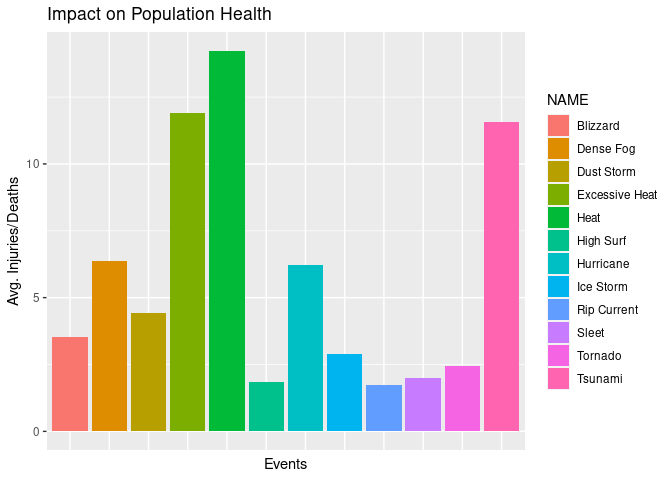
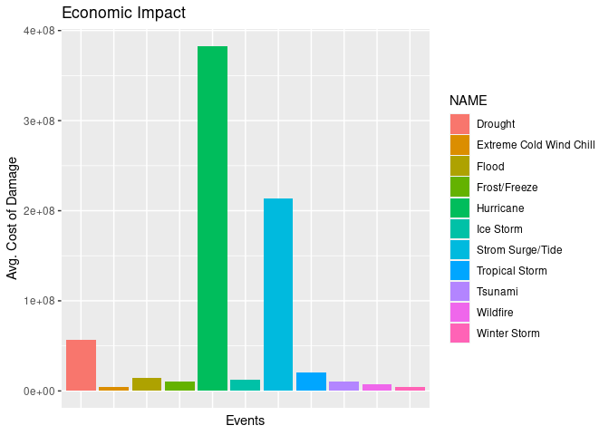

# Synopsis
This report aims to analyse the impact of sever weather events on the health of a population as well as the corresponding economic cost. I hypothesize that there will be an increased impact on population health and higher economic costs incurred with increasing severity of weather events. Data from NOAA Storm Database was used to test this hypothesis. (Enter results here)

# Data Processing
The raw data is available in the form of a compressed CSV file and can be downloaded from [here](https://d396qusza40orc.cloudfront.net/repdata%2Fdata%2FStormData.csv.bz2).

## Downloading the Data

```r
library("R.utils")

if(!file.exists("./Data")){dir.create("./Data")}
fileURL <- "https://d396qusza40orc.cloudfront.net/repdata%2Fdata%2FStormData.csv.bz2"
download.file(fileURL, destfile = "./Data/stormData.csv.bz2")
bunzip2("./Data/stormData.csv.bz2", "./Data/stormData.csv", remove = FALSE, skip = TRUE)
```

## Reading the Data

```r
library("dplyr")

rawData <- read.csv("./Data/stormData.csv", stringsAsFactors = FALSE)
data <- select(rawData, EVTYPE, FATALITIES, INJURIES, PROPDMG, PROPDMGEXP, CROPDMG, CROPDMGEXP)
```

## Cleaning the Data
The raw data is messy and needs to be cleaned up before use.The cost incurred due to property damage and crop damage have been split into two variables, one containing the base amount and the other containing the exponent. By using the `sub` function, the character values representing each exponent is substituted with the integer value.

```r
# Property Damage Exp 
data$PROPDMGEXP <- sub("?", "1", data$PROPDMGEXP, fixed = TRUE)
data$PROPDMGEXP <- sub("-", "1", data$PROPDMGEXP, fixed = TRUE)
data$PROPDMGEXP <- sub("+", "1", data$PROPDMGEXP, fixed = TRUE)
data$PROPDMGEXP <- sub("0", "1", data$PROPDMGEXP)
data$PROPDMGEXP <- sub("1", "10", data$PROPDMGEXP)
data$PROPDMGEXP <- sub("2", "100", data$PROPDMGEXP)
data$PROPDMGEXP <- sub("3", "1000", data$PROPDMGEXP)
data$PROPDMGEXP <- sub("4", "10000", data$PROPDMGEXP)
data$PROPDMGEXP <- sub("5", "100000", data$PROPDMGEXP)
data$PROPDMGEXP <- sub("6", "1000000", data$PROPDMGEXP)
data$PROPDMGEXP <- sub("7", "10000000", data$PROPDMGEXP)
data$PROPDMGEXP <- sub("8", "100000000", data$PROPDMGEXP)
data$PROPDMGEXP <- sub("H", "100", data$PROPDMGEXP, ignore.case = TRUE)
data$PROPDMGEXP <- sub("K", "1000", data$PROPDMGEXP, ignore.case = TRUE)
data$PROPDMGEXP <- sub("M", "1000000", data$PROPDMGEXP, ignore.case = TRUE)
data$PROPDMGEXP <- sub("B", "1000000000", data$PROPDMGEXP, ignore.case = TRUE)

data$PROPDMGEXP <- as.integer(data$PROPDMGEXP)
na <- is.na(data$PROPDMGEXP)
data$PROPDMGEXP[na] <- 1

# Crop Damage Exp
data$CROPDMGEXP <- sub("?", "1", data$CROPDMGEXP, fixed = TRUE)
data$CROPDMGEXP <- sub("0", "1", data$CROPDMGEXP)
data$CROPDMGEXP <- sub("2", "100", data$CROPDMGEXP)
data$CROPDMGEXP <- sub("K", "1000", data$CROPDMGEXP, ignore.case = TRUE)
data$CROPDMGEXP <- sub("M", "1000000", data$CROPDMGEXP, ignore.case = TRUE)
data$CROPDMGEXP <- sub("B", "1000000000", data$CROPDMGEXP, ignore.case = TRUE)

data$CROPDMGEXP <- as.integer(data$CROPDMGEXP)
na <- is.na(data$CROPDMGEXP)
data$CROPDMGEXP[na] <- 1
```
The main problem is that there are 48 official extreme weather events cited by NOAA. However, there are 900 ++ events listed in the data. Most of these are typos or similar events beings assigned dissimilar names. Events are categorized into their respective NOAA categories using the `grep` and `agrep` functions.

```r
# Astronomical Low Tide (1)
row <- grep("ASTRONOMICAL LOW TIDE|Blow-out tide", data$EVTYPE, ignore.case = TRUE)
data$EVTYPE[row] <- 1
reqData <- data[row,]

# Avalanche (2)
row <- grep("AVALANCHE|Avalance", data$EVTYPE, ignore.case = TRUE)
data$EVTYPE[row] <- 2
tmp <- data[row,]
reqData <- rbind(reqData, tmp)

# Blizzard (3)
row <- agrep("BLIZZARD", data$EVTYPE, ignore.case = TRUE)
data$EVTYPE[row] <- 3
tmp <- data[row,]
reqData <- rbind(reqData, tmp)

# Coastal Flood (4)
row <- grep("COASTAL FLOOD|Cstl|Beach Flood|COASTALFLOOD|TIDAL FLOOD|COASTAL  FLOODING/EROSION", data$EVTYPE, ignore.case = TRUE)
data$EVTYPE[row] <- 4
tmp <- data[row,]
reqData <- rbind(reqData, tmp)

# Extreme Cold Wind Chill (13)
row <- grep("Extreme Cold|Bitter|Extreme Wind Chil|EXTREME WINDCHILL|Hypothermia|HYPERTHERMIA", data$EVTYPE, ignore.case = TRUE)
data$EVTYPE[row] <- 13
tmp <- data[row,]
reqData <- rbind(reqData, tmp)

# Debris Flow (6)
row <- grep("SLIDE|Landslump", data$EVTYPE, ignore.case = TRUE)
data$EVTYPE[row] <- 6
tmp <- data[row,]
reqData <- rbind(reqData, tmp)

# Freezing Fog (18)
row <- grep("FREEZING FOG|ICE FOG|Fog and cold temp", data$EVTYPE, ignore.case = TRUE)
data$EVTYPE[row] <- 18
tmp <- data[row,]
reqData <- rbind(reqData, tmp)

# Dense Fog (7)
row <- grep("DENSE FOG|VOG|FOG", data$EVTYPE, ignore.case = TRUE)
data$EVTYPE[row] <- 7
tmp <- data[row,]
reqData <- rbind(reqData, tmp)

# Dense Smoke (8)
row <- grep("SMOKE", data$EVTYPE, ignore.case = TRUE)
data$EVTYPE[row] <- 8
tmp <- data[row,]
reqData <- rbind(reqData, tmp)

# Dust devil (10)
row <- grep("DUST DEVIL|DEVEL|Blowing Dust", data$EVTYPE, ignore.case = TRUE)
data$EVTYPE[row] <- 10
tmp <- data[row,]
reqData <- rbind(reqData, tmp)

# Dust Storm (11)
row <- grep("DUST STORM|Saharan Dust|Duststorm", data$EVTYPE, ignore.case = TRUE)
data$EVTYPE[row] <- 11
tmp <- data[row,]
reqData <- rbind(reqData, tmp)

# Excessive Heat (12)
row <- grep("EXCESSIVE HEAT|High temp", data$EVTYPE, ignore.case = TRUE)
data$EVTYPE[row] <- 12
tmp <- data[row,]
reqData <- rbind(reqData, tmp)

# Flash Flood (14)
row <- grep("FLASH", data$EVTYPE, ignore.case = TRUE)
data$EVTYPE[row] <- 14
tmp <- data[row,]
reqData <- rbind(reqData, tmp)

# Lakeshore Flood (28)
row <- grep("LAKESHORE", data$EVTYPE, ignore.case = TRUE)
data$EVTYPE[row] <- 28
tmp <- data[row,]
reqData <- rbind(reqData, tmp)

# Flood (15)
row <- grep("FLOOD|FLDG|FLD|DAM BREAK|DAM FAILURE", data$EVTYPE, ignore.case = TRUE)
data$EVTYPE[row] <- 15
tmp <- data[row,]
reqData <- rbind(reqData, tmp)

# Frost/Freeze (16)
row <- grep("FROST|Freeze|Black Ice|Glaze|ICE ROADS|ICE JAM|ICE FLOES|ICE ON ROAD|
            ICY ROADS", data$EVTYPE, ignore.case = TRUE)
data$EVTYPE[row] <- 16
tmp <- data[row,]
reqData <- rbind(reqData, tmp)

# Funnel Cloud (17)
row <- agrep("FUNNEL CLOUD", data$EVTYPE, ignore.case = TRUE)
data$EVTYPE[row] <- 17
tmp <- data[row,]
reqData <- rbind(reqData, tmp)

# Hail (19)
row <- grep("HAIL|ICE PELLETS", data$EVTYPE, ignore.case = TRUE)
data$EVTYPE[row] <- 19
tmp <- data[row,]
reqData <- rbind(reqData, tmp)

# Heat (20)
row <- grep("HEAT|Abnormal Warmth|Hot|RECORD TEMPERATURE|RECORD WARM|Record Warmth|
            Temperature record|UNSEASONABLY HOT|UNSEASONABLY WARM|UNUSUAL WARMTH|
            UNUSUALLY WARM", data$EVTYPE, ignore.case = TRUE)
data$EVTYPE[row] <- 20
tmp <- data[row,]
reqData <- rbind(reqData, tmp)

# Heavy Rain (21)
row <- grep("HEAVY RAIN|FREEZING RAIN|PROLONGED RAIN|TORRENTIAL|EXCESSIVE RAIN|
            HVY RAIN|Abnormally wet|Excessive precipitation|Excessive wet|
            EXTREMELY WET|Freezing drizzle|Freezing Spray|HEAVY PRECIPATATION|
            HEAVY SHOWERS|RAIN (HEAVY)|RAINSTORM|RECORD PRECIPITATION|
            RECORD RAINFALL|HEAVY PRECIPITATION|HEAVY SHOWER|HVY RAIN",
            data$EVTYPE, ignore.case = TRUE)
data$EVTYPE[row] <- 21
tmp <- data[row,]
reqData <- rbind(reqData, tmp)

# Heavy Snow (22)
row <- grep("SNOW", data$EVTYPE, ignore.case = TRUE)
data$EVTYPE[row] <- 22
tmp <- data[row,]
reqData <- rbind(reqData, tmp)

# High Surf (23)
row <- grep("SURF", data$EVTYPE, ignore.case = TRUE)
data$EVTYPE[row] <- 23
tmp <- data[row,]
reqData <- rbind(reqData, tmp)

# High Wind (24)
row <- grep("HIGH WIND|Downburst|Microburst|Gusty|Gradient Wind|HIGH  WINDS|STORM FORCE WINDS",
            data$EVTYPE, ignore.case = TRUE)
data$EVTYPE[row] <- 24
tmp <- data[row,]
reqData <- rbind(reqData, tmp)

# Hurricane (Typhoon) (25)
row <- grep("HURRICANE|Coastal Storm|Coastalstorm|Coastal Storm|TYPHOON", data$EVTYPE, ignore.case = TRUE)
data$EVTYPE[row] <- 25
tmp <- data[row,]
reqData <- rbind(reqData, tmp)

# Ice Storm (26)
row <- grep("ICE STORM", data$EVTYPE, ignore.case = TRUE)
data$EVTYPE[row] <- 26
tmp <- data[row,]
reqData <- rbind(reqData, tmp)

# Lake-Effect Snow (27)
row <- agrep("LAKE EFFECT SNOW", data$EVTYPE, ignore.case = TRUE)
data$EVTYPE[row] <- 27
tmp <- data[row,]
reqData <- rbind(reqData, tmp)

# Lightning (29)
row <- agrep("LIGHTNING", data$EVTYPE, ignore.case = TRUE)
data$EVTYPE[row] <- 29
tmp <- data[row,]
reqData <- rbind(reqData, tmp)

# Marnine Hail (30)
row <- grep("MARINE HAIL", data$EVTYPE, ignore.case = TRUE)
data$EVTYPE[row] <- 30
tmp <- data[row,]
reqData <- rbind(reqData, tmp)

# Marine High Wind (31)
row <- grep("MARINE HIGH", data$EVTYPE, ignore.case = TRUE)
data$EVTYPE[row] <- 31
tmp <- data[row,]
reqData <- rbind(reqData, tmp)

# Marine Strong Wind (32)
row <- grep("MARINE STRONG", data$EVTYPE, ignore.case = TRUE)
data$EVTYPE[row] <- 32
tmp <- data[row,]
reqData <- rbind(reqData, tmp)

# Marine Thunderstorm Wind (33)
row <- grep("MARINE THUDERSTORM|MARINE TSTM", data$EVTYPE, ignore.case = TRUE)
data$EVTYPE[row] <- 33
tmp <- data[row,]
reqData <- rbind(reqData, tmp)

# Rip Current (34)
row <- grep("RIP CURRENT", data$EVTYPE, ignore.case = TRUE)
data$EVTYPE[row] <- 34
tmp <- data[row,]
reqData <- rbind(reqData, tmp)

# Seiche (35)
row <- grep("SEICHE", data$EVTYPE, ignore.case = TRUE)
data$EVTYPE[row] <- 35
tmp <- data[row,]
reqData <- rbind(reqData, tmp)

# Sleet (36)
row <- grep("SLEET", data$EVTYPE, ignore.case = TRUE)
data$EVTYPE[row] <- 36
tmp <- data[row,]
reqData <- rbind(reqData, tmp)

# Strom Surge/Tide (37)
row <- grep("SURGE", data$EVTYPE, ignore.case = TRUE)
data$EVTYPE[row] <- 37
tmp <- data[row,]
reqData <- rbind(reqData, tmp)

# Strong Wind (38)
row <- grep("STRONG WIND", data$EVTYPE, ignore.case = TRUE)
data$EVTYPE[row] <- 38
tmp <- data[row,]
reqData <- rbind(reqData, tmp)

# Thunderstorm Wind (39)
row <- grep("STORM WIND|TSTM WIND|TSTM WND|TSTMW|THUNDERSTORM  WINDS|
            THUNDERSTORM W INDS|THUNDERSTORM WINS|THUNDERSTORMS WIND|
            THUNDERSTORMW|THUNDERSTROM WIND|THUNDERTORM WINDS|
            THUNDERTSORM WIND", data$EVTYPE, ignore.case = TRUE)
data$EVTYPE[row] <- 39
tmp <- data[row,]
reqData <- rbind(reqData, tmp)

# Tornado (40)
row <- grep("TORNADO|Funnel|Gustnado|TORNDAO|WHIRLWIND", data$EVTYPE, ignore.case = TRUE)
data$EVTYPE[row] <- 40
tmp <- data[row,]
reqData <- rbind(reqData, tmp)

# Tropical Depression (41)
row <- grep("DEPRESSION", data$EVTYPE, ignore.case = TRUE)
data$EVTYPE[row] <- 41
tmp <- data[row,]
reqData <- rbind(reqData, tmp)

# Tropical Storm (42)
row <- grep("TROPICAL STORM", data$EVTYPE, ignore.case = TRUE)
data$EVTYPE[row] <- 42
tmp <- data[row,]
reqData <- rbind(reqData, tmp)

# Tsunami (43)
row <- grep("TSUNAMI", data$EVTYPE, ignore.case = TRUE)
data$EVTYPE[row] <- 43
tmp <- data[row,]
reqData <- rbind(reqData, tmp)

# Volcanic Ash (44)
row <- grep("VOLCANIC ASH", data$EVTYPE, ignore.case = TRUE)
data$EVTYPE[row] <- 44
tmp <- data[row,]
reqData <- rbind(reqData, tmp)

# Waterspout (45)
row <- agrep("WATERSPOUT", data$EVTYPE, ignore.case = TRUE)
data$EVTYPE[row] <- 45
tmp <- data[row,]
reqData <- rbind(reqData, tmp)

# Wildfire (46)
row <- grep("FIRE", data$EVTYPE, ignore.case = TRUE)
data$EVTYPE[row] <- 46
tmp <- data[row,]
reqData <- rbind(reqData, tmp)

# Winter Storm (47)
row <- grep("WINTER STORM", data$EVTYPE, ignore.case = TRUE)
data$EVTYPE[row] <- 47
tmp <- data[row,]
reqData <- rbind(reqData, tmp)

# Winter Weather (48)
row <- grep("WINTER WEATHER", data$EVTYPE, ignore.case = TRUE)
data$EVTYPE[row] <- 48
tmp <- data[row,]
reqData <- rbind(reqData, tmp)

# Cold/Wind Chill (5)
row <- grep("COLD/WIND|Cold wind|Cold|Cool|LOW TEMPERATURE|LOW WIND CHILL|
            WIND CHILL|WND", data$EVTYPE, ignore.case = TRUE)
data$EVTYPE[row] <- 5
tmp <- data[row,]
reqData <- rbind(reqData, tmp)

# Drought (9)
row <- grep("DROUGHT|Abnormally Dry|BELOW NORMAL PRECIPITATION|Dry", data$EVTYPE, 
            ignore.case = TRUE)
data$EVTYPE[row] <- 9
tmp <- data[row,]
reqData <- rbind(reqData, tmp)
```
The event names are replaced by integer values in order to prevent the same data from being used twice. A separate data frame is created to match the integer values to their respective names.

```r
# Data Frame of Events and Corresponding Number Tags
events <- c("Astronomical Low Tide", "Avalanche", "Blizzard", "Coastal Flood",
            "Cold/Wind Chill","Debris Flow", "Dense Fog", "Dense Smoke", "Drought",
            "Dust devil", "Dust Storm","Excessive Heat", "Extreme Cold Wind Chill",
            "Flash Flood", "Flood", "Frost/Freeze","Funnel Cloud", "Freezing Fog",
            "Hail", "Heat", "Heavy Rain", "Heavy Snow", "High Surf","High Wind",
            "Hurricane", "Ice Storm", "Lake-Effect Snow", "Lakeshore Flood", "Lightning",
            "Marnine Hail", "Marine High Wind", "Marine Strong Wind", "Marine Thunderstorm Wind",
            "Rip Current", "Seiche", "Sleet", "Strom Surge/Tide", "Strong Wind",
            "Thunderstorm Wind","Tornado", "Tropical Depression", "Tropical Storm",
            "Tsunami", "Volcanic Ash", "Waterspout","Wildfire", "Winter Storm", "Winter Weather")
key <- data.frame(EVTYPE = c(1:48), NAME = as.character(events))
```
Lastly, a new variable HEALTH is created by adding the values from the variables INJURIES and FATALITIES. This will be used to assess the impact on health. To assess the economic impact, a new variable ECONOMIC is created by summing the cost of property as well as crop damage.

```r
library("dplyr")
reqData$HEALTH <- with(reqData, FATALITIES + INJURIES)
reqData$PROPDMG <- with(reqData, PROPDMG * PROPDMGEXP)
reqData$CROPDMG <- with(reqData, CROPDMG * CROPDMGEXP)
reqData$ECONOMIC <- with(reqData, PROPDMG + CROPDMG)

cleanData <- reqData %>%
        select(EVTYPE, HEALTH, ECONOMIC) %>%
        filter(HEALTH > 0 | ECONOMIC > 0) %>%
        group_by(EVTYPE)
```

## Analysing the Data
From the clean data obtained, we then proceed to find the average impact of each weather event.

```r
summary <- summarise(cleanData, MH = mean(HEALTH), ME = mean(ECONOMIC))
```

```
## `summarise()` ungrouping output (override with `.groups` argument)
```

```r
merged <- merge(summary, key, by = "EVTYPE")
```
## Plotting

```r
library("ggplot2")
topHealth <- filter(merged, MH >= 1.7176) # Where 1.7176 is the 75th percentile value
a <- ggplot(topHealth, aes(NAME, MH)) +
        geom_bar(stat = "identity", aes(fill = NAME)) +
        ggtitle("Impact on Population Health") +
        xlab("Events") +
        ylab("Avg. Injuries/Deaths") +
        theme(axis.text.x = element_blank(), axis.ticks.x = element_blank())
print(a)
```

<!-- -->

```r
topEconomic <- filter(merged, ME >= 3410027.64)
b <- ggplot(topEconomic, aes(NAME, ME)) +
        geom_bar(stat = "identity", aes(fill = NAME)) +
        ggtitle("Economic Impact") +
        xlab("Events") +
        ylab("Avg. Cost of Damage") +
        theme(axis.text.x = element_blank(), axis.ticks.x = element_blank())
print(b)
```

<!-- -->

# Results
It can be seen from the bar graphs that: 
  1. The extreme weather event that has the greatest impact on the health of the general population is HEAT.
  2. The extreme weather event that has the greatest economic impact are HURRICANEs.
                                                                                                                                                                                                                                                                                                                                                                                                                                                                                                                                                                                                                                                                                                                                                                                                              
